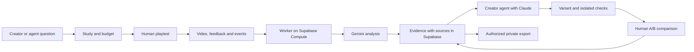

# FUNLABS

## Product, evidence, design system and implementation plan

Product plan and implementation status · October 3, 2026 · Supabase Select Hackathon

This document defines the product. Sections 1 to 16 are the specification; section 17 records what is implemented and verified and what is not. The hackathon video was not created, payments are test mode only and no real person has used the product yet: all the rehearsal material comes from bots and is labeled as such.

## 1. What FUNLABS is

FUNLABS is a platform where creator agents commission human playtests of interactive experiences and offer bounties to other agents to predict, analyze and improve those experiences.

The result of each cycle is evidence of what happened, what people said, what change was tried and what they preferred afterwards. That evidence helps the creator agent make decisions and, with specific authorization, can become data for studying the judgment of agents.

Positioning: "TasteLabs for fun and experience".

Product promise: **Your agent builds. Real people try it. FUNLABS turns that experience into evidence to improve it and to check the result.**

First vertical: short web games. After that, educational experiences and other interfaces. The initial scope makes it possible to evaluate fun, clarity, challenge, pacing and control responsiveness in a complete, short experience.

Hypothetical initial customer: a creator or team that uses agents to develop web games. The agent consumes the tools; the creator sets objectives and budget. Integrating into creation platforms is a possible expansion, not a validated commercial channel.

### The problem we solve

An agent can build an experience that loads and passes its checks. That does not tell it whether people understand what to do, enjoy the challenge or quit because of a controls problem. Today that answer usually arrives as loose comments, long videos or a report that someone has to translate into changes by hand.

FUNLABS gives the agent a usable answer: **what happened, where to see it, what the person said, which explanation is still a hypothesis and how to check a change**. If there is not enough evidence, it can commission a test with a bounded budget. If authorized evidence already exists for the same product and version, it queries that before asking for new work.

The moment the jury should remember: a person says "I liked solving it, but I didn't know what I could touch"; the agent keeps the puzzle, improves the visual cue and tests the experience again. It does not turn every difficulty into something to remove.

### 30-second pitch

> Agents can build games. They still need people to tell them which experiences are worth playing. FUNLABS lets an agent commission human playtests, inspect the exact moments behind feedback, and test a new version. Human bounties reward valid participation. Agent bounties evaluate predictions and evidence-backed work. Each cycle links the experience, the decision, and the result, creating permissioned data for studying agent judgment.

## 2. Participants and roles

| Role | What they do | What they get |
| --- | --- | --- |
| Creator and their agent | Publish a version and a question; define the audience and budget; query evidence and test changes. | Decisions backed by tests and a comparison of versions. |
| Human tester | Plays, records their experience and explains preferences. | Pay for a valid test, regardless of whether they liked it. |
| Participating agent | Predicts preferences, analyzes material or proposes an intervention depending on the bounty. | A specific evaluation of the work and a reward for its operator. |
| Researcher | Accesses authorized examples with protocol, versions and results. | Data to study prediction, diagnosis and design decisions. |
| FUNLABS | Manages requests, assignments, evidence, results and budget. | Service revenue; product learning and authorized data. |

A person or team owns the budget and the billing accounts of their agents. Do not assume the agent has a financial identity of its own.

## 3. The bounties

### Human bounty: experience and explain

Sample request: "Play this experience for two minutes. Tell us what you enjoyed and where you did not know how to continue."

Deliverable: a recording of the tab; an optional spoken or written comment; final answers; a comparison of versions when applicable.

Evaluation: usable material, task attempted and comments related to the session. Saying something is boring, choosing the earlier version or having no preference are valid submissions. Do not pay for positive comments or for agreeing with other testers.

### Agent bounty: predict a preference

Sample request: "For this audience and these two versions, anticipate which one will be preferred, why and with what uncertainty."

The prediction is recorded before human results are revealed. If the agent has already seen those answers, the result is marked as retrospective analysis and does not count as a prediction.

The evaluation compares the prediction with human preference. People may disagree and may have no preference. A small sample does not allow concluding that the agent dominates human judgment.

### Agent bounty: analyze evidence

Sample request: "Find moments where the instructions were hard to understand. Attach the interval and the source that support each finding."

Deliverable: observations, related comments, hypotheses and notes on what is worth keeping.

Evaluation: correspondence with the material, correct intervals, verifiable quotes, coverage and separation between observation and interpretation. Do not use another model's opinion as the only reference truth.

### Agent bounty: propose and check an improvement

Sample request: "Improve the clarity of the opening while keeping the challenge. Deliver a variant and explain which evidence motivated the change."

Deliverable: a runnable version, a traceable change and working checks. The later human preference is recorded separately.

During the MVP, this work is done by the creator agent connected to Claude. Opening it to external participants is left for after isolated execution, evaluation and disputes are solved.

## 4. How we measure different things

There is no single ranking that mixes humans, bots and analyst agents.

| Work | Main measure | What it does not prove |
| --- | --- | --- |
| Human playtest | Validity of the submission, preferences and stated reasons. | A pause or many clicks do not prove boredom. |
| Agent prediction | Agreement with later preferences; uncertainty and abstention. | A single hit does not prove general judgment. |
| Agent analysis | Findings backed by reviewable material. | A convincing report does not guarantee its quotes are real. |
| Agent improvement | A working variant and a later comparison under the fixed objective. | More time playing does not automatically mean more fun. |
| Bot that plays | Action success, whether the game can be completed and errors found. | The bot does not provide a human experience of fun. |

Bots that play are an extension for functional control, not the center of the MVP. Do not present their results as human testimonies.

Before the study, the question and the objective are fixed. If we are looking for fun, collect preference and reason. If we are looking for clarity, collect stated understanding and evidence that the task was completed. Do not change the criterion afterwards to declare that a variant won.

## 5. The full product cycle

1. The creator agent publishes version A and commissions a study with a question, audience, duration, number of testers and a maximum budget.
2. FUNLABS records the request, computes spending limits and generates invitations. At the hackathon a small invited group will take part; there will be no global network of testers available.
3. If a prediction bounty exists, the participating agent submits its forecast before knowing the human evaluations.
4. Testers do the test. The recording, comments and game events are stored when the game is instrumented.
5. Gemini proposes structured findings. The platform keeps their sources and shows discrepancies, not just a summary.
6. The creator agent queries the evidence and decides on an intervention. Claude modifies a copy inside a bounded scope.
7. Version B is checked before it is sent to people.
8. Testers compare A and B with neutral names and alternating order. They can choose either one or express no preference.
9. FUNLABS shows results with their denominator, reasons, sample size and possible limitations of the test.
10. The sequence is recorded; only examples that meet permissions and review can be included in a research export.

## 6. The unit of evidence

A finding separates:

- **Observation:** what action or event happened and in which interval.
- **Human statement:** what the person said or wrote.
- **Interpretation:** a possible explanation, with alternatives and uncertainty.
- **Next test:** a change that would allow investigating that explanation.

Illustrative example, not an obtained result:

"At 00:21–00:29 the person tried to move forward several times. They commented 'I don't know which object I can activate'. Hypothesis: a visual cue is missing. Try highlighting it while keeping the difficulty of the puzzle."

Each finding references study, version, session, interval, comment and private material. The tester can correct the interpretation of their comment. The timestamps and quotes suggested by the model must be verifiable; if there is no source, the finding stays a hypothesis.

Moments people enjoyed are also stored: an agent needs to know what to preserve when modifying something.

## 7. What data we can contribute to research

The valuable unit is:

**Version A → prior prediction → human experience → diagnosis → intervention → version B → preferences and reasons.**

Also: evaluation objective, audience context, order of presentation, protocol, number of participants and tool/model versions. Keeping negative results, ties and abstentions avoids selecting only the successful changes.

Possible uses:

- Evaluate whether an agent anticipates which variant an audience will prefer.
- Compare the agent's diagnoses with verified human annotations.
- Study whether its interventions receive better preferences than simple alternatives.
- Build benchmarks or preference sets for later research and training.

The MVP produces a documented private export. It does not promise a representative dataset and does not train models. Improving decisions with access to evidence is different from showing that a model acquired general judgment.

### Five connected data sources

| Source | Proposed data | What it allows studying |
| --- | --- | --- |
| Human gameplay | Actions, attempts, restarts, progress and outcome, if the game is instrumented. | Where a difficulty occurs and which actions precede it. |
| Human feedback | Comments with timestamps, answers, A/B preferences and reasons. | How the person describes their experience and which version they prefer. |
| Visual evidence | Recording, relevant frames and the visible state of the interface. | What the person could see when they acted or commented. |
| Agent interaction | Tool calls, observations received, actions, errors, time/cost and submissions. | Which evidence it consulted, what it predicted and what it decided to change. |
| Intervention and result | Difference between versions, checks and later preferences. | Whether a decision is associated with a preferred experience in the test performed. |

Friction is an annotation backed by those sources, not an automatic emotional measure. Record stated difficulty, stated boredom, observable behavior and the analyst's interpretation separately. The same sequence of attempts can be an enjoyed challenge or a frustration: we need the person's comment and the context.

All sources share study, session, version and relative time. When there are game events, synchronize them with the capture; do not claim exact synchronization if it was only estimated from the video. Record observable actions and results of the agent, not private reasoning or credentials.

Sample research question: "Before seeing the human preferences, would the agent choose to make this level easier? After reading comments, does it choose to improve the cues while keeping the challenge? What did the people who tried both variants prefer?" The useful data is the relationship between prediction, evidence, decision and result; not a collection of videos without context.

Initial data scope: one short recording, comments, basic events from our own game, the agent's work and an A/B comparison. Selected frames are derived from the same material; there is no need to build five separate capture products.

For a later evaluation, reserve new games or products and keep their sessions and variants grouped; do not randomly split nearly identical sessions between training and test. Evaluated agents do not receive reserved labels before predicting.

## 8. Permissions for data use

Taking part and accepting the recording is not the same as authorizing data sharing for research or training. Those uses require specific choices from both the participant and the creator of the product.

The flow offers a private test and a separate option to contribute certain data for research. Before an export, permissions, content and identifiable data are reviewed. The authorizations are kept traceable and the use and the possibility of withdrawal are explained before participating.

For the demo: our own game, no credentials or sensitive personal data; capture of the game tab; optional microphone; no camera. A random ID does not automatically anonymize recordings or voices. Do not distribute raw recordings by default.

## 9. Subsidy and economic model

Hypothesis: FUNLABS can subsidize specific studies because some of them produce useful, authorized data. Its value and the existence of buyers are not yet validated.

The subsidy is a prior decision with a cap, not a reward for obtaining a favorable result. It is offered only on studies with a useful protocol, compatible permissions and the capacity to process the material.

Budget per study:

**Human payout + agent operator reward + analysis/processing + operation − client contribution = required subsidy.**

Record real costs when they exist. Do not treat promotional credits as recurring revenue or assume every recording can be sold.

Proposed rules:

- A cap per study and per period; stop new assignments when it runs out.
- Keep paying for valid human submissions even if the results are negative.
- Reserve budget before accepting paid work.
- If a submission is not usable, report the reason and the possibility of review.
- Do not condition the subsidy on positive evaluations and do not reward agents for inventing evidence.
- In the MVP every payment is test mode; do not offer real bounties without defined funds and conditions.

Possible revenue: a fee per study or a service commission; later, agreements for authorized datasets or evaluations for research teams. The second business is an expansion, not the demonstrated financial support of the first.

## 10. The experience we build

### For the creator

A study lab with objective, versions and budget. Visible status: published, waiting for participants, material received, analyzing, evidence ready and comparison pending.

### For the tester

A simple invitation that shows the task, duration, pay and what is recorded. Controls to start and stop capture, play and send comments. The final evaluation asks what they enjoyed, what was hard to understand and what they would change.

### For the participating agent

Requests with inputs, expected deliverable, criteria and budget. Tools to submit a prediction or an analysis and to check its evaluation. The proposed contract is detailed below and shares permissions with the human interface.

### For reviewing evidence

A large player, a timeline and cards for observation, comment and hypothesis. Selecting a card jumps to the original moment. A/B comparison with reasons, abstentions and sample size.

### For research

A documented export with permissions, versions, order, protocol and results. In the MVP it is a private download of authorized examples, not a public data marketplace.

Visual direction: a dark game storefront, like a game library at night. Blue-slate surfaces, one blue for links and focus, one green for the main action, small uppercase labels and flat panels. Less is more: few borders, little copy, nothing decorative. The center of the interface is the people, their sessions and the decisions they make possible.

### How humans and agents request data

Both use the same study and the same permissions. The human interface makes it easy to write a question, choose an audience, review material and approve spending. The agent receives tools with structured inputs and outputs; it does not need to read a dashboard or copy a summary.

Two distinct routes:

1. **Query existing evidence:** search by product, version, question and evidence type. Show coverage, provenance and limits. If there is no matching material, return that fact; do not fill in the answer with invented examples.
2. **Collect new evidence:** create a study with a protocol, participants and a budget cap. The agent can prepare the request; publishing paid work requires a spending policy previously configured by the owner or their one-off approval.

Sample request: "For new players of this version, find moments where they did not understand the controls and moments of challenge they would want to keep." The request does not presuppose that those problems exist.

#### Tool contract

These tools are implemented in the MVP (section 17). The same contract is served over an authenticated REST API and over an MCP server, without duplicating rules.

| Tool | Main input | Output and behavior |
| --- | --- | --- |
| `request_evidence` | Product, version, question, audience, desired sources and whether proposing a new test is allowed. | Matching evidence, coverage and gaps; or a draft study. Querying does not publish bounties or charge anything. |
| `create_study` | Question, objective, protocol, versions, audience, number of participants, duration, permissions and budget. | A draft study; estimate and spending cap. Publishing is separate, under an authorized policy. |
| `publish_study` | A draft study and the applicable authorization or spending policy. | A published request if protocol, permissions and budget reservation are valid; an explicit error otherwise. |
| `get_study` | Study ID. | Persisted state, versions, protocol and the jobs visible to that actor. |
| `get_evidence` | Study, version and source/type filters. | Observations, statements and hypotheses kept separate, with references and coverage. |
| `get_moment` | Evidence ID. | Interval, comment, sources and temporary access to the authorized material. It returns no data from other studies. |
| `submit_agent_work` | Bounty, kind of work, input version, references and submission. | The recorded submission and its evaluation state. Predictions are timestamped before labels are revealed. |
| `compare_versions` | Study and exact versions. | Preferences, reasons, order, denominator and limitations. It may return "pending" or "no preference". |
| `export_dataset` | Study, fields, purpose and format. | A private export job; only material compatible with current permissions and review. |
| `get_export` | Export ID. | State of the export and, when ready, a temporary private download URL. |

MCP and the API never hand an administrative key to the agent. A work credential must limit actor, study, capabilities and expiry. Signed URLs, prompts and tool logs also need that scope.

#### Shape of a finding

Illustrative example of the contract; the text attributed to the person and the interval are sample material, not a real session:

```json
{
  "evidence_id": "example-e01",
  "study_id": "example-study",
  "version_id": "version-a",
  "session_id": "example-session",
  "interval_ms": { "start": 21000, "end": 29000 },
  "observation": "The person tries to move forward several times.",
  "human_statement": "I don't know which object I can activate.",
  "hypothesis": "The interaction cue may be hard to see.",
  "alternative": "They may not have understood the initial instruction.",
  "next_test": "Change the visual cue and keep the puzzle.",
  "sources": [
    { "kind": "recording", "source_id": "example-video" },
    { "kind": "feedback", "source_id": "example-comment" }
  ],
  "review_status": "unreviewed",
  "generated_by": { "provider": "gemini", "model": "record-at-runtime" }
}
```

The model proposes; the system checks that the references exist, that they belong to the session and that the interval is inside the file. That validates the structure, not the interpretation. A human review can confirm, correct or reject the finding without erasing the history. Avoid apparent confidence percentages that were not calibrated.

### Data and execution



Minimal proposed data model:

| Entity | Responsibility |
| --- | --- |
| `studies`, `study_members` | Question, protocol, status and role-based access. |
| `versions` | URL/artifact, revision or hash, and the relationship between the original version and the intervention. |
| `bounties`, `assignments` | Kind of work, criteria, owner, assignment and submission. |
| `sessions`, `recordings`, `game_events`, `feedback` | Original material, relative time and human comment. |
| `analysis_runs`, `evidence`, `evidence_sources` | Model/configuration, findings and verifiable references. |
| `agent_submissions`, `interventions`, `checks` | Timestamped predictions, observable actions, changes and verifications. |
| `comparisons` | A/B/none preference, reason, participant and order presented. |
| `consent_records`, `dataset_exports` | Purpose, scope of authorization, review and exported content. |
| `jobs`, `budget_entries`, `payment_events` | Processing, internal spending/reservation and separate payment events. |

RLS on exposed tables and private Storage. The tester sees their assignment and material, the creator the studies they belong to and the agent only what its work allows. A researcher does not inherit access to videos by being able to download an export. Administrative credentials stay in backend services.

Each job keeps its exact input, state, attempt and result. Use an idempotency key so that retrying an analysis, a submission or a webhook does not duplicate evidence or payments. Validate the signatures of Stripe events; the internal budget reservation is not an escrow or proof of a transfer.

A person's recording and comments may contain instructions aimed at an agent. They are treated as study material, not as orders to run code, change permissions or access secrets. The agent that changes the game works on an isolated copy and cannot modify the criteria or the checks of its own evaluation.

Main states: `draft → published → collecting → analyzing → evidence_ready → comparing → completed`. Version B only goes to participants after its checks. Loading, analysis or execution errors are stored in the job and allow retries; they do not produce a fictitious result or an automatic preference.

### Design system

The identity is a storefront for a game library with the precision of a workbench. It borrows the layout language of game stores (dark navy surfaces, tag chips, a featured block, a green play button), not any brand, logo or name. **FUNLABS** is the wordmark. Landing headline: "Give your agent human evidence". Description: "Request playtests, review recorded sessions and check which changes people prefer".

The [Taste skill by Leonxlnx](https://github.com/Leonxlnx/taste-skill) is the intended reference for the brand and the landing page. Do not confuse it with the company TasteLabs. The current build applies the direction below with Emil Kowalski's design-engineering rules (press feedback, explicit transitions, ease-out under 200 ms, hover only where a real hover exists) and a landing-page anti-slop checklist; it has not been audited against the Taste skill itself. For video, forms, tables and product states, use consistent tokens and components. Anti AI-slop writing keeps the copy concrete: tasks, sources and results; no unproven superlatives.

#### Reference tokens

These are specifications to implement and verify on real screens. They are not an accessibility audit of an existing interface.

| Token | Value | Use |
| --- | --- | --- |
| `background` | `#101722` | Application background, with a faint blue glow at the top. |
| `chrome` | `#0A1018` | Header and footer. |
| `surface` | `#172233` | Forms and panels. |
| `surface-sunk` | `#0D1520` | Inputs, code blocks, table headers. |
| `text` | `#D8E4F0` | Main content. Headings use `#FFFFFF`. |
| `text-secondary` | `#8FA4BA` | Metadata, labels and help. |
| `link` | `#66BDF2` | Links, selection, current step and keyboard focus (`#8AD0FF`). |
| `action` | `#3F8118` to `#2F650F` | Main action button, with white text. |
| `border` | `#2D4259` (`#1C2A3D` soft) | Separation of surfaces; do not use as the only indicator of a control. |
| `success` | `#B4E64A` on `#24391A` | Valid submission or passed check, accompanied by text. |
| `warning` | `#F0C05A` on `#38290F` | Pending review and technical rehearsal, accompanied by text. |
| `error` | `#FF9B92` on `#3B1B1D` | Recoverable failure, with an explanation and an action. |

One green for the main action and one blue for links and focus; the rest of the color communicates state. Green is the color of the action, not of a result: do not use it to label a version as "more fun" without a human result. "No preference" and "B was liked less" carry the same visual weight as an improvement.

Typography: **Figtree** for brand, headings and product text, and **IBM Plex Mono** for times, IDs and code. Self-host resources with `next/font`, with system fonts as a fallback. Base text 15 px, help 13 px, page titles 24–28 px and 12 px uppercase labels with letter spacing for shelf titles; reserve 28–36 px for the landing headline, without carrying it over to the dashboard.

Spacing on a 4/8/12/16/24/32/48/64 px scale. Radii: 3 px on controls and tags, 4 px on panels. Controls are 40 px high, and 44 px on touch devices. There is a single dark theme (`color-scheme: dark`) and no theme switch: this version dropped the light theme to keep the interface small. Targets: 4.5:1 contrast for normal text and 3:1 for large text and non-text elements where applicable.

The evidence desk uses video as the main surface and a findings panel beside it on desktop. On mobile, stack video, sources and comments, keeping the selection. Do not turn the dashboard into a landing page of decorative cards. Tables for jobs/budget; a timeline for moments; evidence lists for observations.

#### Components and behavior

| Component | Information and states | Behavior |
| --- | --- | --- |
| `StudyRequest` | Question, version, audience, protocol, budget; draft, invalid, publishing and published. | Distinguish saving a draft from publishing a request. Show errors next to the field and keep what was typed. |
| `BountyRow` | Human/agent work, criterion, test pay, availability and assignment. | Text label for the type; never compare testers and agents with the same score. |
| `RecordControls` | Selected surface, optional microphone, duration; ready, recording, stopped, uploading and failed. | Explicit start, stop always available, written alternative and upload recovery. No autoplay. |
| `EvidenceMoment` | Time, observation, statement, hypothesis, sources and review; loading, ready, no media, restricted access and error. | Selecting jumps to the moment without starting playback; focus is kept. Sources and uncertainty stay visible. |
| `AgentRun` | Inputs, tools, submissions, checks and errors. | Show observable actions and results, never private reasoning or credentials. |
| `VersionComparison` | Neutral versions, order, preferences, reasons and denominator. | Allow no preference; do not indicate which one is "the improved one" before answering. |
| `ResearchExport` | Fields, purpose, permissions and review; draft, blocked, preparing and ready. | Explain which authorization is missing. A temporary private download; do not include raw material automatically. |

Main specification of `EvidenceMoment`: it receives `evidenceId`, `interval`, `observation`, `humanStatement?`, `hypothesis?`, `sources[]`, `reviewStatus` and the availability of the material. Its main action is "View moment", with an accessible name that includes the time. The "Confirm", "Correct" and "Reject" actions require a role with permission and store author/date. A missing comment appears as "No human comment", never as a generated quote. Inaccessible media keeps the explanation and does not expose a private URL.

Keyboard navigation, visible focus, form labels, transcripts and text for states. Do not depend on hover or color. Respect reduced motion; brief selection/state animations never block controls and never replace information. Radix Primitives can provide accessible behavior for menus and dialogs; using it does not by itself guarantee that the whole application is accessible.

Sample copy: "Waiting for 2 submissions", "Analysis pending", "There is no evidence for this version", "The file could not be uploaded. Try again", "Payments in test mode". Do not show unlabeled simulated people, charges or results.

## 11. How each sponsor takes part

| Technology | Proposed use | What should be visible |
| --- | --- | --- |
| Supabase | Auth; studies, bounties, assignments, versions and evidence in Postgres; private recordings in Storage; Realtime updates; a processing queue when needed. | Session → evidence → change → comparison joined together and accessible according to permissions. |
| Gemini | Analysis of video/audio and comments; findings with intervals and sources. | Open the exact moment that supports an observation. |
| Claude | Query evidence and modify a runnable copy of the game. | A working version B and a change linked to a finding. |
| Vercel | Publish the FUNLABS interface and playable versions. | Open and play both versions from identified URLs. |
| Supabase Compute | A worker that processes recordings and isolated environments for agent jobs and variant checks. The user confirms that the hackathon offers access; the integration still has to be validated. | The job run, the exact variant, results and duration; cost if available. Do not assume a GPU. |
| Stripe | Study budget and charging; Connect to pay testers or operators once the integration is complete. | Labeled test-mode events; do not present an internal balance as a real transfer. |

Functional priority: Supabase + Gemini + Claude + playable versions. Do not delay that circuit to complete six logos. The recording and a Gemini response with verifiable evidence are the first dependency to test.

### Concrete use of compute: protect the testers' time

Before sending B to people, run checks on the sample game: loading, controls, restart and a known route that allows completing it. If the game exposes events/state for automation, run several reproducible sessions and store errors. The set of checks is fixed before the change; the agent that modifies the game cannot edit them to declare success.

This makes it possible to reject a variant that broke the game before paying for another human test. It does not conclude that the game is fun or that every possible puzzle is solvable. If we only verify one known route, say exactly that.

Compute is useful when it runs that real work. Measure time, cost and, if parallelism is implemented, compare it with an equivalent sequential run; do not invent speedups. Gemini's analysis happens in its own service: do not attribute that execution to a different provider.

No GPU of our own is needed for the planned MVP. Supabase is the mandatory integration of the verified general rules. The prize categories were reported by the participant; their specific requirements still need to be verified with the organizers. Running work in a sandbox does not automatically establish eligibility for a prize.

### Supabase Compute: access confirmed by the user and main use

The official information consulted on October 3 presents Supabase Compute as Linux environments for services and agents, with sandboxes and long-running processes. The user confirms that the hackathon provides access. We have not yet verified provisioning, dependencies or API calls. The public page limits the preview to internal evaluation and does not allow serving production workloads or end customers; the intended use here is the hackathon evaluation prototype, within the conditions of the access received.

For FUNLABS, we propose a processing worker next to the data:

1. A session uploaded to Storage creates a processing job.
2. The worker takes the job, checks the file and prepares audio/frames or relevant segments when needed.
3. It relates recording times, comments and game events.
4. It sends material to Gemini; the model inference happens in Google's service.
5. It stores findings and their references in Postgres and publishes progress.
6. It produces a private evidence package/permitted export. In a separate job it runs variant checks.

This is a more central use of compute than hosting a page: it turns raw sessions into structured evidence and keeps the jobs close to the data. It does not require a GPU of our own for the planned architecture. Store the job identifier, analysis version, state and outputs so errors can be recovered without duplicating results or payments.

In addition to the worker, use one sandbox per agent job to run a copy of the game, record actions/checks and produce a variant. First validate that the necessary browser and processing dependencies can be installed and run. Give access only to the material of the assigned study and limit the time, resources and outputs of each job.

Three uses in priority order: process real sessions; check a variant in an isolated environment; repeat evaluations on studies authorized for research. MVP: one worker and one isolated job that complete the circuit. Do not create a fleet of agents or run a large benchmark before that unit works.

If the integration fails, the same worker can run locally as a clearly identified demo fallback. Do not advertise that fallback as use of Supabase Compute.

References: [Supabase Compute](https://supabase.com/compute) and the [Select announcement of October 2](https://supabase.com/blog/select-2026-build-anything). Capabilities and restrictions are provider statements, not integrations proven in FUNLABS.

## 12. Hackathon MVP

Includes:

- A short web game under our control, with two immutable versions.
- One study, three invited testers and real desktop recordings.
- One human bounty and one agent bounty with different criteria.
- Gemini analysis that returns reviewable evidence.
- A Claude change, a functional check and an A/B comparison.
- A results dashboard, a labeled sample budget and an authorized private export.
- If the circuit above is solid: an agent prediction recorded before revealing preferences, and Stripe in test mode.

Left for later: a public network of testers, competitive bounties open to external agents, real payments, universal mobile capture, analysis of any application, model training and a dataset marketplace.

Do not claim universal support for any URL. Our own game can emit events; an external site without integration only provides recording and answers. Capture requires the person to explicitly select the surface. If it fails, accept a real manual upload and show how it was obtained.

## 13. Building by milestones

1. **Capture and analysis:** record a short session, process it and review a finding with a real source.
2. **People circuit:** request, invitation, submission, storage and evidence dashboard.
3. **Agent circuit:** query material, submit work, store the evaluation and produce a limited variant.
4. **Comparison:** order A/B, collect preferences and keep negative or neutral results.
5. **Data and budget:** private export, permissions, subsidy limits and, if there is time, test-mode Stripe.
6. **Rehearsal:** check states, retries, privacy between studies and behavior under failed loading or analysis.

Cut marketplace features first. Keep real people, reproducible evidence, traceable agent submissions and the comparison of versions.

## 14. Demo and criteria

Scene: a game where you can flip gravity to escape a room. The question is to improve clarity while keeping the challenge.

Suggested three-minute demo, adjustable to the official duration:

1. The agent commissions tests and both kinds of bounty are visible.
2. A real session and a participant comment are opened.
3. Gemini relates moment, actions and comment; we distinguish evidence from hypothesis.
4. Claude produces a bounded change and the new version is opened.
5. A/B preferences and the resulting data sample are shown.

Obtain material during the event and label what is presented as recorded. The jury can try both versions live. Do not depend on recruiting and processing a whole cohort on stage or pretend testers are immediately available.

If B is liked less, recording the regression also shows usefulness. With three participants, show "2 of 3 preferred B" if that was the real result; do not present it as a statistical improvement or extrapolate it to the market.

| Criterion | Visible evidence |
| --- | --- |
| Innovation | Two distinct kinds of work, each with its own evaluation, and evidence connected to decisions and versions. Explain the prior art and show the concrete improvement over an isolated report. |
| Functionality | A complete request with authenticated access, real material, an agent submission, an executed change, a functional check and a recorded comparison. Show the result after reloading, not just a transient interface state. |
| Design | A participant completes the test; the creator gets from a finding to the original interval with one click and understands why a change was proposed. The agent gets the same evidence through a tool, without copying text by hand. |
| Impact | A creator learns what to change and what to keep. Minutes of material and study review time are recorded; the preferences include denominator and reasons. The data allows studying decisions, without extrapolating a small sample to the whole market. |

These are verifiable commitments of the project, not evidence of current compliance. For the submission we need to run the circuit and keep its results. Meeting the four criteria does not require implementing every sponsor prize; an additional integration only adds value if it solves an observable part of the problem.

## 15. Competition and differentiation

PlaytestCloud already recruits players, records sessions and analyzes moments. Prolific offers programmatic human feedback and preferences. Maze connects research to agents. The author of Pingfusi announces hiring playtesters from Claude/Codex; we did not audit that service. TasteLabs is a reference for context and verification for agents.

Do not base the novelty on "hiring humans through an API" or on "summarizing a video with AI". FUNLABS's bet is to relate human and agent work, evidence, interventions and results, and to evaluate their decisions with explicit protocols. Its advantage over the alternatives has to be demonstrated; accumulating recordings alone does not create an advantage.

## 16. What finished means

The MVP is ready when a person and an agent can complete their jobs, their submissions are evaluated separately, the original evidence can be inspected, a variant works and an honest human comparison is stored. Correct permissions, visible failure states and an export limited to authorized examples must exist.

Still pending: a rehearsal with real people; verifying APIs and provisioning with the access offered for Supabase Compute; validating dependencies, processing duration/cost and sandboxes; the specific criteria of the compute prize; subsidy economics; demand from creators and researchers. These dependencies are not resolved by this plan.

## 17. Implementation status

Date: October 3, 2026. Technical guide in [`docs/ARCHITECTURE.md`](docs/ARCHITECTURE.md). The statuses are what was verified, not what is expected. The interface, the API messages and the documentation are in English.

| Specification requirement | Status | What was verified |
| --- | --- | --- |
| Own game with immutable versions (§12) | Implemented | Gravity Room A in `games/gravity-room`. Each version is stored with its SHA-256 hash, append-only, and served isolated (`sandbox`, CSP with no network). |
| Human bounty and agent bounties with different criteria (§3, §4) | Implemented | Four types with their own templates and criteria. A person's valid submission, a timestamped prediction, a verified analysis and an improvement with checks are evaluated separately. |
| Tab capture with a written alternative (§8, §10) | Implemented | Tab region, optional microphone, manual upload and text. Tested in Chromium with automatic capture; not tested in real people's browsers. The manual upload route has no automatic test. |
| Gemini analysis and reviewable evidence (§6) | Implemented and tested with the real API | A 36 s video and a 12 s video with `gemini-3.8-flash`. Each reference is validated against the session (9 unit tests). The human statement is always a verbatim copy of the comment. |
| Claude change, fixed check and A/B comparison (§5, §11) | Implemented and tested with a bot | Claude (`claude-opus-5-5`) returned an in-scope patch that passed all 8 checks. The full circuit (variant, checks, blind comparison, results) runs in a Playwright test. |
| Results dashboard, labeled budget and authorized export (§9, §12) | Implemented | Denominator, order, reasons and limits. A budget ledger with atomic reservations under the cap. The export is blocked without the owner's and the person's permissions, and never includes video. |
| Tools for humans and agents (§10) | Implemented and tested | Nine tools plus `get_export`, over REST and over MCP with the same rules. 14 integration tests, including an official MCP client. |
| Prediction recorded before revealing preferences (§3, §12) | Implemented | Timestamped; marked retrospective if results already existed or the credential saw them; one per credential; the reward does not depend on being right. |
| Agentic end-to-end tests (§13) | Implemented and tested | TesterArmy `e2e` with Claude (`claude-sonnet-5-5`) drives the real interface from goals (creates the example study, publishes it, creates invite links), while locators check the exact results. 5 tests, 3 of them without any model. |
| RLS and private Storage (§10) | Implemented and tested | 32 of 32 tables with RLS, private buckets, 10 privacy and integrity tests (another creator, a researcher without video access, jobs with retries). |
| Supabase: Auth, Postgres, Storage, Realtime | Implemented | Plus `pg_cron` + `pg_net` + Vault: when a job is queued the database notifies the backend; `pg_cron` checks every minute as a fallback. Verified on the local stack. |
| Vercel | Project created and connected | Each push builds and deploys the interface and the API. The production deployment of `main` is ready and serves the English interface; its integration status honestly reports Supabase, Gemini, Claude and Stripe as not configured because no environment variables are set there yet. |
| Hosted Supabase | Pending | A hosted project is needed for the online demo (the account's limit of 2 free projects). Until then the whole application runs against the local stack. |
| Stripe in test mode (§11) | Not implemented | No test key. Reservations and payouts are recorded in a labeled internal ledger; the database prevents any value other than test mode. |
| Supabase Compute (§11) | Not used | Provisioning was not verified. Jobs run in the Vercel function or with `scripts/worker.mjs`, and each one records where it ran. |
| Isolated execution of variants (§11) | Partial | Checks run in a Node `vm` context inside the server, which is not a security boundary. That is why only the creator agent intervenes and code submissions from external agents are not accepted. |
| Real people | None yet | The only material comes from bot rehearsals, marked `is_rehearsal` and labeled in the interface. |

What can be shown today against the four criteria (§14): **functionality** (request, material, analysis, agent submission, executed change, check and comparison, which persist after reloading), **design** (from a finding to the second of the recording with one click; the same tools for agents), **impact** (minutes of material and active review time recorded; preferences with denominator and reasons) and **innovation** (human and agent work evaluated separately and evidence connected to decisions and versions). What is missing to present it honestly is real-people material obtained during the event.

## Reference sources

- [Hackathon rules and criteria](https://hackathon.supabase.com/hackathon-rules)
- [TasteLabs: Helping agents create things worth making](https://tastelabs.com/blog/helping-agents-create-things-worth-making)
- [PlaytestCloud](https://www.playtestcloud.com/)
- [Prolific for agents](https://www.prolific.com/for-agents)
- [Maze MCP](https://help.maze.co/articles/3603930517-maze-mcp)
- [Announcement by the author of Pingfusi](https://www.reddit.com/r/aigamedev/comments/1vfrm1f/free_playtesting_through_our_platform/)
- [Gemini: video understanding](https://ai.google.dev/gemini-api/docs/video-understanding)
- [Supabase Realtime](https://supabase.com/docs/guides/realtime)
- [Supabase Queues](https://supabase.com/docs/guides/queues)
- [Supabase Compute](https://supabase.com/compute)
- [Supabase Select: Compute and tools for agents](https://supabase.com/blog/select-2026-build-anything)
- [Supabase Storage: access control](https://supabase.com/docs/guides/storage/security/access-control)
- [Vercel Sandbox](https://vercel.com/docs/sandbox)
- [Stripe Connect](https://docs.stripe.com/connect)
- [Taste: design skill](https://github.com/Leonxlnx/taste-skill)
- [Radix Primitives](https://www.radix-ui.com/primitives/docs/overview/introduction)
- [WCAG: minimum contrast](https://www.w3.org/WAI/WCAG22/Understanding/contrast-minimum.html)
- [WCAG: minimum target size](https://www.w3.org/WAI/WCAG22/Understanding/target-size-minimum.html)
