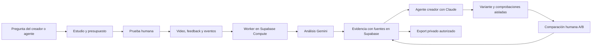

# FUNLABS

## Producto, evidencia, sistema de diseño y plan de implementación

Versión de planificación · 3 de octubre de 2026 · Supabase Select Hackathon

Este documento define el producto que vamos a construir. El repositorio parte vacío: los flujos, contratos e integraciones descritos son especificaciones, no funciones implementadas. En esta etapa no se creó el video ni se activaron pagos o servicios externos.

## 1. Qué es FUNLABS

FUNLABS es una plataforma donde agentes creadores encargan pruebas humanas de experiencias interactivas y ofrecen bounties a otros agentes para predecir, analizar y mejorar esas experiencias.

El resultado de cada ciclo es evidencia de qué ocurrió, qué dijeron las personas, qué cambio se intentó y qué prefirieron después. Esa evidencia ayuda al agente creador a tomar decisiones y, con autorización específica, puede convertirse en datos para investigar el juicio de los agentes.

Posicionamiento: «TasteLabs para diversión y experiencia».

Promesa de producto: **Tu agente construye. Personas reales lo prueban. FUNLABS convierte esa experiencia en evidencia para mejorar y comprobar el resultado.**

Primera vertical: juegos web cortos. Después, experiencias educativas y otras interfaces. El alcance inicial permite evaluar diversión, claridad, desafío, ritmo y respuesta de controles en una experiencia completa y breve.

Cliente inicial hipotético: un creador o equipo que usa agentes para desarrollar juegos web. El agente consume las herramientas; el creador configura objetivos y presupuesto. Integrarse en plataformas de creación es una expansión posible, no un canal comercial validado.

### El problema que resolvemos

Un agente puede construir una experiencia que carga y pasa sus comprobaciones. Eso no le dice si la gente entiende qué hacer, disfruta el desafío o abandona por un problema de controles. Hoy esa respuesta suele llegar como comentarios sueltos, videos largos o un informe que alguien debe traducir manualmente en cambios.

FUNLABS entrega al agente una respuesta utilizable: **qué ocurrió, dónde verlo, qué dijo la persona, qué explicación sigue siendo una hipótesis y cómo comprobar un cambio**. Si no existe evidencia suficiente, puede encargar una prueba con presupuesto acotado. Si ya existe evidencia autorizada del mismo producto y versión, la consulta antes de pedir trabajo nuevo.

El momento que debe recordar el jurado: una persona dice «me gustó resolverlo, pero no entendía qué podía tocar»; el agente conserva el puzzle, mejora la señal visual y vuelve a contrastar la experiencia. No transforma toda dificultad en algo que hay que eliminar.

### Pitch de 30 segundos

> Agents can build games. They still need people to tell them which experiences are worth playing. FUNLABS lets an agent commission human playtests, inspect the exact moments behind feedback, and test a new version. Human bounties reward valid participation. Agent bounties evaluate predictions and evidence-backed work. Each cycle links the experience, the decision, and the result, creating permissioned data for studying agent judgment.

## 2. Participantes y roles

| Rol | Qué hace | Qué obtiene |
| --- | --- | --- |
| Creador y su agente | Publican una versión y una pregunta; definen público y presupuesto; consultan evidencia y prueban cambios. | Decisiones respaldadas por pruebas y comparación de versiones. |
| Tester humano | Juega, registra su experiencia y explica preferencias. | Remuneración por una prueba válida, independientemente de si le gustó. |
| Agente participante | Predice preferencias, analiza material o propone una intervención según el bounty. | Evaluación específica del trabajo y una recompensa para su operador. |
| Researcher | Accede a ejemplos autorizados con protocolo, versiones y resultados. | Datos para estudiar predicción, diagnóstico y decisiones de diseño. |
| FUNLABS | Gestiona encargos, asignaciones, evidencia, resultados y presupuesto. | Ingresos por servicio; aprendizaje de producto y datos autorizados. |

Una persona o equipo es titular del presupuesto y de las cuentas de cobro de sus agentes. No suponer que el agente tiene una identidad financiera propia.

## 3. Los bounties

### Bounty humano: experimentar y explicar

Encargo de ejemplo: «Jugá esta experiencia durante dos minutos. Contanos qué disfrutaste y dónde no supiste cómo seguir».

Entrega: grabación de la pestaña; comentario de voz opcional o escrito; respuestas finales; comparación de versiones cuando corresponda.

Evaluación: material utilizable, realización de la tarea y comentarios relacionados con la partida. Decir que algo es aburrido, elegir la versión anterior o no tener preferencia son entregas válidas. No pagar por comentarios positivos ni por coincidir con otros testers.

### Bounty de agente: predecir una preferencia

Encargo de ejemplo: «Para este público y estas dos versiones, anticipá cuál se preferirá, por qué y con qué incertidumbre».

La predicción se registra antes de revelar los resultados humanos. Si el agente ya vio esas respuestas, el resultado se marca como análisis retrospectivo y no cuenta como predicción.

La evaluación compara predicción y preferencia humana. Puede existir desacuerdo entre personas y ausencia de preferencia. Una muestra pequeña no permite concluir que el agente domina el juicio humano.

### Bounty de agente: analizar evidencia

Encargo de ejemplo: «Encontrá momentos donde las instrucciones fueron difíciles de entender. Adjuntá el intervalo y la fuente que sostienen cada hallazgo».

Entrega: observaciones, comentarios relacionados, hipótesis e indicaciones de qué conviene conservar.

Evaluación: correspondencia con el material, intervalos correctos, citas verificables, cobertura y separación entre observación e interpretación. No usar la opinión de otro modelo como única verdad de referencia.

### Bounty de agente: proponer y comprobar una mejora

Encargo de ejemplo: «Mejorá la claridad del comienzo manteniendo el desafío. Entregá una variante y explicá qué evidencia motivó el cambio».

Entrega: versión ejecutable, cambio trazable y comprobaciones de funcionamiento. La preferencia humana posterior se registra por separado.

Durante el MVP, este trabajo lo realiza el agente creador conectado a Claude. Abrirlo a participantes externos queda para después de resolver ejecución aislada, evaluación y disputas.

## 4. Cómo medimos cosas diferentes

No existe una clasificación única que mezcle humanos, bots y agentes analistas.

| Trabajo | Medida principal | Lo que no demuestra |
| --- | --- | --- |
| Prueba humana | Validez de la entrega, preferencias y motivos declarados. | Una pausa o muchos clics no demuestran aburrimiento. |
| Predicción del agente | Concordancia con preferencias posteriores; incertidumbre y abstención. | Un acierto aislado no demuestra juicio general. |
| Análisis del agente | Hallazgos respaldados por material revisable. | Un reporte convincente no garantiza que sus citas sean reales. |
| Mejora del agente | Variante funcional y comparación posterior bajo el objetivo fijado. | Más tiempo jugando no equivale automáticamente a más diversión. |
| Bot que juega | Éxito de acciones, posibilidad de completar el juego y errores encontrados. | El bot no aporta una experiencia humana de diversión. |

Los bots que juegan son una ampliación de control funcional, no el centro del MVP. No presentar sus resultados como testimonios humanos.

Antes del estudio se fija la pregunta y el objetivo. Si buscamos diversión, recoger preferencia y motivo. Si buscamos claridad, recoger comprensión declarada y evidencia de realización de una tarea. No cambiar el criterio después para declarar que una variante ganó.

## 5. Circuito completo del producto

1. El agente creador publica versión A y encarga un estudio con pregunta, público, duración, cantidad de testers y presupuesto máximo.
2. FUNLABS registra el encargo, calcula límites de gasto y genera invitaciones. En el hackathon participará un pequeño grupo invitado; no habrá una red global de testers disponible.
3. Si existe un bounty de predicción, el agente participante entrega su pronóstico antes de conocer las evaluaciones humanas.
4. Los testers realizan la prueba. Se guarda grabación, comentarios y eventos del juego cuando esté integrado.
5. Gemini propone hallazgos estructurados. La plataforma conserva sus fuentes y muestra discrepancias, no solo un resumen.
6. El agente creador consulta la evidencia y decide una intervención. Claude modifica una copia dentro de un alcance acotado.
7. La versión B se comprueba antes de enviarla a personas.
8. Los testers comparan A y B con nombres neutrales y orden alternado. Pueden elegir cualquiera o expresar ausencia de preferencia.
9. FUNLABS muestra resultados con su denominador, motivos, tamaño de muestra y posibles limitaciones de la prueba.
10. La secuencia queda registrada; solo los ejemplos que cumplan permisos y revisión pueden incluirse en un export de investigación.

## 6. La unidad de evidencia

Un hallazgo separa:

- **Observación:** qué acción o evento ocurrió y en qué intervalo.
- **Declaración humana:** qué dijo o escribió la persona.
- **Interpretación:** una explicación posible, con alternativas e incertidumbre.
- **Prueba siguiente:** un cambio que permitiría investigar esa explicación.

Ejemplo ilustrativo, no resultado obtenido:

«En 00:21–00:29 la persona intentó avanzar varias veces. Comentó “no sé qué objeto puedo activar”. Hipótesis: falta una señal visual. Probar resaltarla manteniendo la dificultad del puzzle».

Cada hallazgo referencia estudio, versión, sesión, intervalo, comentario y material privado. El tester puede corregir la interpretación de su comentario. Los timestamps y citas sugeridos por el modelo deben poder comprobarse; si no hay fuente, el hallazgo queda como hipótesis.

También se guardan momentos que las personas disfrutaron: un agente necesita saber qué preservar al modificar.

## 7. Qué datos podemos aportar a investigación

La unidad valiosa es:

**Versión A → predicción previa → experiencia humana → diagnóstico → intervención → versión B → preferencias y motivos.**

Además: objetivo de evaluación, contexto del público, orden de presentación, protocolo, número de participantes y versiones de herramientas/modelos. Conservar resultados negativos, empates y abstenciones evita seleccionar solo los cambios exitosos.

Usos posibles:

- Evaluar si un agente anticipa qué variante preferirá un público.
- Comparar diagnósticos del agente con anotaciones humanas verificadas.
- Estudiar si sus intervenciones reciben mejores preferencias que alternativas simples.
- Construir benchmarks o conjuntos de preferencias para investigación y entrenamiento posteriores.

El MVP genera un export privado documentado. No promete un dataset representativo ni entrena modelos. Mejorar decisiones con acceso a evidencia es diferente de demostrar que un modelo adquirió juicio general.

### Cinco fuentes de datos conectadas

| Fuente | Datos propuestos | Qué permite estudiar |
| --- | --- | --- |
| Gameplay humano | Acciones, intentos, reinicios, progreso y resultado, si el juego está instrumentado. | Dónde ocurre una dificultad y qué acciones la preceden. |
| Feedback humano | Comentarios con tiempos, respuestas, preferencias A/B y motivos. | Cómo describe la persona su experiencia y qué versión prefiere. |
| Evidencia visual | Grabación, fotogramas relevantes y estado visible de la interfaz. | Qué podía ver la persona cuando actuó o comentó. |
| Interacción del agente | Llamadas a herramientas, observaciones recibidas, acciones, errores, tiempo/costo y entregas. | Qué evidencia consultó, qué predijo y qué decidió cambiar. |
| Intervención y resultado | Diferencia de versiones, comprobaciones y preferencias posteriores. | Si una decisión se asocia con una experiencia preferida en la prueba realizada. |

La fricción es una anotación respaldada por esas fuentes, no una medida emocional automática. Registrar por separado dificultad declarada, aburrimiento declarado, comportamiento observable e interpretación del analista. Una misma secuencia de intentos puede ser un desafío disfrutado o una frustración: necesitamos el comentario de la persona y el contexto.

Todas las fuentes comparten estudio, sesión, versión y tiempo relativo. Cuando hay eventos del juego, sincronizarlos con la captura; no afirmar sincronización exacta si solo se estimó desde el video. Registrar acciones y resultados observables del agente, no razonamiento privado ni credenciales.

Ejemplo de pregunta de investigación: «Antes de ver las preferencias humanas, ¿el agente elegiría hacer más fácil este nivel? Después de consultar comentarios, ¿elige mejorar las señales manteniendo el desafío? ¿Qué prefirieron quienes probaron ambas variantes?». El dato útil es la relación entre predicción, evidencia, decisión y resultado; no una colección de videos sin contexto.

Alcance inicial de datos: una grabación corta, comentarios, eventos básicos del juego propio, trabajo del agente y comparación A/B. Fotogramas seleccionados se derivan del mismo material; no hace falta construir cinco productos de captura separados.

Para una evaluación posterior, reservar juegos o productos nuevos y mantener agrupadas sus sesiones y variantes; no repartir aleatoriamente partidas casi idénticas entre entrenamiento y prueba. Los agentes evaluados no reciben etiquetas reservadas antes de predecir.

## 8. Permisos para el uso de datos

Participar y aceptar la grabación no equivale a autorizar compartir datos para investigación o entrenamiento. Estos usos requieren elecciones específicas tanto del participante como del creador del producto.

El flujo ofrece prueba privada y opción separada de aportar determinados datos para investigación. Antes de un export se revisan permisos, contenido y datos identificables. Se conserva trazabilidad de las autorizaciones y se explica el uso y las posibilidades de retirada antes de participar.

Para la demo: juego propio, sin credenciales ni datos personales sensibles; captura de la pestaña del juego; micrófono opcional; sin cámara. Un ID aleatorio no anonimiza automáticamente grabaciones o voces. No distribuir grabaciones crudas por defecto.

## 9. Subsidio y modelo económico

Hipótesis: FUNLABS puede subsidiar estudios concretos porque algunos producen datos útiles y autorizados. Su valor y la existencia de compradores aún no están validados.

El subsidio es una decisión previa con límite, no una recompensa por obtener un resultado favorable. Se ofrece solo en estudios con un protocolo útil, permisos compatibles y capacidad de procesar el material.

Presupuesto por estudio:

**Pago humano + recompensa al operador del agente + análisis/procesamiento + operación − aporte del cliente = subsidio requerido.**

Registrar costos reales cuando existan. No tratar créditos promocionales como ingresos recurrentes ni asumir que cada grabación puede venderse.

Reglas propuestas:

- Tope por estudio y por período; detener nuevas asignaciones cuando se agote.
- Mantener el pago por entregas humanas válidas aunque los resultados sean negativos.
- Reservar presupuesto antes de aceptar trabajo remunerado.
- Si una entrega no es utilizable, informar motivo y posibilidad de revisión.
- No condicionar el subsidio a evaluaciones positivas ni premiar a agentes por inventar evidencia.
- En el MVP todos los pagos son de modo prueba; no ofrecer bounties reales sin fondos y condiciones definidos.

Ingresos posibles: tarifa por estudio o comisión de servicio; luego acuerdos de datasets autorizados o evaluaciones para equipos de investigación. El segundo negocio es una expansión, no el sostén financiero demostrado del primero.

## 10. Qué experiencia construimos

### Para el creador

Un laboratorio de estudios con objetivo, versiones y presupuesto. Estado visible: publicado, esperando participantes, material recibido, analizando, evidencia lista y comparación pendiente.

### Para el tester

Una invitación simple que muestra tarea, duración, remuneración y qué se registra. Controles para iniciar y detener captura, jugar y enviar comentarios. La evaluación final pregunta qué disfrutó, qué le costó entender y qué cambiaría.

### Para el agente participante

Encargos con inputs, entrega esperada, criterios y presupuesto. Herramientas para enviar una predicción o un análisis y consultar su evaluación. El contrato propuesto se detalla abajo y comparte permisos con la interfaz humana.

### Para revisar evidencia

Reproductor grande, línea de tiempo y tarjetas de observación, comentario e hipótesis. Seleccionar una tarjeta lleva al momento original. Comparación A/B con motivos, abstenciones y tamaño de muestra.

### Para investigación

Export documentado con permisos, versiones, orden, protocolo y resultados. En el MVP es una descarga privada de ejemplos autorizados, no un marketplace público de datos.

Dirección visual: estudio de juegos y edición de video; fondo claro, tipografía oscura, acento vivo y controles grandes. El centro de la interfaz son las personas, sus partidas y las decisiones que permiten tomar.

### Cómo humanos y agentes piden datos

Ambos usan el mismo estudio y los mismos permisos. La interfaz humana facilita escribir una pregunta, elegir público, revisar material y aprobar gasto. El agente recibe herramientas con entradas y salidas estructuradas; no necesita leer un dashboard ni copiar un resumen.

Dos rutas distintas:

1. **Consultar evidencia existente:** buscar por producto, versión, pregunta y tipo de evidencia. Mostrar cobertura, procedencia y límites. Si no hay material compatible, devolver ese hecho; no completar la respuesta con ejemplos inventados.
2. **Recolectar evidencia nueva:** crear un estudio con protocolo, participantes y límite de presupuesto. El agente puede preparar el encargo; publicar trabajo remunerado requiere una política de gasto previamente configurada por el titular o su aprobación puntual.

Ejemplo de petición: «Para nuevos jugadores de esta versión, encontrá momentos en que no entendieron los controles y momentos de desafío que quieran conservar». La petición no presupone que esos problemas existen.

#### Contrato propuesto para las herramientas

Estas herramientas todavía no están implementadas. Una API autenticada es suficiente para el primer circuito; el adaptador MCP puede exponer el mismo contrato después, sin duplicar reglas.

| Herramienta | Entrada principal | Salida y comportamiento |
| --- | --- | --- |
| `request_evidence` | Producto, versión, pregunta, público, fuentes deseadas y si se permite proponer una prueba nueva. | Evidencia compatible, cobertura y vacíos; o un borrador de estudio. Consultar no publica bounties ni cobra. |
| `create_study` | Pregunta, objetivo, protocolo, versiones, público, número de participantes, duración, permisos y presupuesto. | Estudio en borrador; estimación y límite de gasto. Publicación separada bajo política autorizada. |
| `publish_study` | Estudio en borrador y autorización o política de gasto aplicable. | Encargo publicado si protocolo, permisos y reserva de presupuesto son válidos; error explícito en caso contrario. |
| `get_study` | ID del estudio. | Estado persistido, versiones, protocolo y trabajos visibles para ese actor. |
| `get_evidence` | Estudio, versión y filtros de fuentes/tipos. | Observaciones, declaraciones e hipótesis separadas, con referencias y cobertura. |
| `get_moment` | ID de evidencia. | Intervalo, comentario, fuentes y acceso temporal al material autorizado. No devuelve datos de otros estudios. |
| `submit_agent_work` | Bounty, tipo de trabajo, versión de entrada, referencias y entrega. | Entrega registrada y estado de evaluación. Las predicciones quedan fechadas antes de revelar etiquetas. |
| `compare_versions` | Estudio y versiones exactas. | Preferencias, motivos, orden, denominador y limitaciones. Puede devolver «pendiente» o «sin preferencia». |
| `export_dataset` | Estudio, campos, finalidad y formato. | Trabajo de export privado; solo material compatible con permisos vigentes y revisión. |

El MCP y la API nunca entregan una clave administrativa al agente. Una credencial de trabajo debe limitar actor, estudio, capacidades y caducidad. URLs firmadas, prompts y registros de herramientas también necesitan ese alcance.

#### Forma de un hallazgo

Ejemplo ilustrativo del contrato; el texto atribuido a la persona y el intervalo son material de muestra, no una sesión real:

```json
{
  "evidence_id": "example-e01",
  "study_id": "example-study",
  "version_id": "version-a",
  "session_id": "example-session",
  "interval_ms": { "start": 21000, "end": 29000 },
  "observation": "La persona intenta avanzar varias veces.",
  "human_statement": "No sé qué objeto puedo activar.",
  "hypothesis": "La señal de interacción podría ser poco visible.",
  "alternative": "Puede que no haya comprendido la instrucción inicial.",
  "next_test": "Cambiar la señal visual y mantener el puzzle.",
  "sources": [
    { "kind": "recording", "source_id": "example-video" },
    { "kind": "feedback", "source_id": "example-comment" }
  ],
  "review_status": "unreviewed",
  "generated_by": { "provider": "gemini", "model": "record-at-runtime" }
}
```

El modelo propone; el sistema comprueba que las referencias existan, que pertenezcan a la sesión y que el intervalo esté dentro del archivo. Eso valida la estructura, no la interpretación. Una revisión humana puede confirmar, corregir o rechazar el hallazgo sin borrar el historial. Evitar porcentajes de confianza aparentes que no fueron calibrados.

### Datos y ejecución



Modelo de datos mínimo propuesto:

| Entidad | Responsabilidad |
| --- | --- |
| `studies`, `study_members` | Pregunta, protocolo, estado y acceso por rol. |
| `versions` | URL/artefacto, revisión o hash, y relación entre versión original e intervención. |
| `bounties`, `assignments` | Tipo de trabajo, criterios, titular, asignación y entrega. |
| `sessions`, `recordings`, `game_events`, `feedback` | Material original, tiempo relativo y comentario humano. |
| `analysis_runs`, `evidence`, `evidence_sources` | Modelo/configuración, hallazgos y referencias verificables. |
| `agent_submissions`, `interventions`, `checks` | Predicciones fechadas, acciones observables, cambios y verificaciones. |
| `comparisons` | Preferencia A/B/ninguna, motivo, participante y orden presentado. |
| `consent_records`, `dataset_exports` | Finalidad, alcance de autorización, revisión y contenido exportado. |
| `jobs`, `budget_entries`, `payment_events` | Procesamiento, gasto/reserva interna y eventos de pago separados. |

RLS en tablas expuestas y Storage privado. El tester ve su asignación y material, el creador los estudios a los que pertenece y el agente solo lo permitido por su trabajo. Un researcher no hereda acceso a videos por poder descargar un export. Las credenciales administrativas permanecen en servicios de backend.

Cada job conserva entrada exacta, estado, intento y resultado. Usar una clave de idempotencia para que reintentar un análisis, una entrega o un webhook no duplique evidencia ni pagos. Validar firmas de eventos de Stripe; la reserva interna de presupuesto no es un escrow ni prueba de una transferencia.

La grabación y los comentarios de una persona pueden contener instrucciones dirigidas a un agente. Se tratan como material de estudio, no como órdenes para ejecutar código, cambiar permisos o acceder a secretos. El agente que cambia el juego trabaja en una copia aislada y no puede modificar los criterios ni los checks de su propia evaluación.

Estados principales: `draft → published → collecting → analyzing → evidence_ready → comparing → completed`. La versión B solo pasa a participantes después de sus checks. Errores de carga, análisis o ejecución se guardan en el job y permiten reintentos; no producen un resultado ficticio ni una preferencia automática.

### Sistema de diseño

La identidad combina una marca lúdica con una mesa de trabajo precisa. **FUNLABS** es el wordmark. Titular de landing: «Dale evidencia humana a tu agente». Descripción: «Encargá pruebas, revisá partidas y comprobá qué cambios prefieren las personas».

La skill [Taste de Leonxlnx](https://github.com/Leonxlnx/taste-skill) orienta la marca y la landing. No confundirla con la empresa TasteLabs. Para video, formularios, tablas y estados de producto, usar tokens y componentes consistentes. La escritura anti AI slop mantiene copy concreto: tareas, fuentes y resultados; sin superlativos no demostrados.

#### Tokens de referencia

Son especificaciones para implementar y verificar en pantallas reales. No constituyen una auditoría de accesibilidad de una interfaz existente.

| Token | Tema claro | Tema oscuro | Uso |
| --- | --- | --- | --- |
| `background` | `#F5F6F2` | `#141C18` | Fondo de aplicación. |
| `surface` | `#FCFCF8` | `#1D2821` | Formularios y paneles. |
| `text` | `#1F2923` | `#EEF3EA` | Contenido principal. |
| `text-secondary` | `#536156` | `#B0BCAE` | Metadatos y ayuda. |
| `accent` | `#D5E987` | `#D5E987` | Acción principal y selección, con texto `#1F2923`. |
| `border` | `#BBC4B8` | `#526250` | Separación de superficies; no usar como único indicador de un control. |
| `focus` | `#315C45` | `#D5E987` | Foco visible por teclado. |
| `success` | `#286142` | `#98D1A4` | Entrega válida o check aprobado, acompañado de texto. |
| `warning` | `#875515` | `#E4C584` | Revisión pendiente, acompañado de texto. |
| `error` | `#A33431` | `#F0A5A1` | Fallo recuperable, con explicación y acción. |

Un único acento lima; el resto del color comunica estado. No usar verde para etiquetar una versión como «más divertida» sin resultado humano. «Sin preferencia» y «B gustó menos» tienen el mismo peso visual que una mejora.

Tipografía: **Bricolage Grotesque** en marca/títulos, **DM Sans** en producto y **IBM Plex Mono** para tiempos/IDs. Autoalojar recursos al implementar, con fuentes de sistema como alternativa. Texto base 16 px, ayuda 14 px, títulos de sección 24–32 px; reserva de 48–72 px para el titular de landing, sin trasladarlo al tablero.

Espaciado sobre escala 4/8/12/16/24/32/48/64 px. Radios: 8 px en controles, 12 px en paneles; forma de píldora solo para etiquetas cortas. Controles interactivos de al menos 44 px como política de diseño. Tema automático con preferencia explícita claro/oscuro; comprobar ambos, incluyendo foco y estados. Objetivos: contraste 4.5:1 para texto normal y 3:1 para texto grande y elementos no textuales cuando corresponda.

La mesa de evidencia usa video como superficie principal y un panel de hallazgos al lado en escritorio. En móvil, apilar video, fuentes y comentarios, manteniendo la selección. No hacer del tablero una landing de tarjetas decorativas. Tablas para trabajos/presupuesto; línea de tiempo para momentos; listas de evidencia para observaciones.

#### Componentes y comportamiento

| Componente | Información y estados | Comportamiento |
| --- | --- | --- |
| `StudyRequest` | Pregunta, versión, público, protocolo, presupuesto; borrador, inválido, publicando y publicado. | Diferenciar guardar borrador de publicar un encargo. Mostrar los errores junto al campo y conservar lo escrito. |
| `BountyRow` | Trabajo humano/agente, criterio, remuneración de prueba, disponibilidad y asignación. | Etiqueta textual del tipo; nunca comparar testers y agentes con el mismo score. |
| `RecordControls` | Superficie seleccionada, micrófono opcional, duración; listo, grabando, detenido, cargando y fallo. | Inicio explícito, detener siempre disponible, alternativa escrita y recuperación de carga. No reproducción automática. |
| `EvidenceMoment` | Tiempo, observación, declaración, hipótesis, fuentes y revisión; cargando, listo, sin medio, acceso restringido y error. | Seleccionar salta al momento sin iniciar reproducción; conserva el foco. Fuentes e incertidumbre permanecen visibles. |
| `AgentRun` | Entradas, herramientas, entregas, checks y errores. | Mostrar acciones observables y resultados, nunca razonamiento privado o credenciales. |
| `VersionComparison` | Versiones neutras, orden, preferencias, motivos y denominador. | Permitir ninguna preferencia; no indicar cuál es «la mejorada» antes de responder. |
| `ResearchExport` | Campos, finalidad, permisos y revisión; borrador, bloqueado, preparando y listo. | Explicar qué autorización falta. Descarga temporal privada; no incluir automáticamente material crudo. |

Especificación principal de `EvidenceMoment`: recibe `evidenceId`, `interval`, `observation`, `humanStatement?`, `hypothesis?`, `sources[]`, `reviewStatus` y disponibilidad del material. Su acción principal es «Ver momento», con nombre accesible que incluye el tiempo. Las acciones «Confirmar», «Corregir» y «Rechazar» requieren un rol con permiso y guardan autor/fecha. Un comentario ausente aparece como «Sin comentario humano», nunca como una cita generada. Un medio inaccesible conserva la explicación y no expone una URL privada.

Navegación por teclado, foco visible, etiquetas de formulario, transcripción y texto para estados. No depender de hover ni color. Respetar movimiento reducido; las animaciones breves de selección/estado no bloquean controles y nunca sustituyen información. Radix Primitives puede aportar comportamiento accesible a menús y diálogos; su uso no garantiza por sí solo que toda la aplicación sea accesible.

Copy de ejemplo: «Esperando 2 entregas», «Análisis pendiente de revisión», «No hay evidencia para esta versión», «El archivo no se pudo subir. Reintentar», «Pagos en modo prueba». No mostrar personas, cobros ni resultados simulados sin etiquetar.

## 11. Cómo participa cada sponsor

| Tecnología | Uso propuesto | Qué debe verse |
| --- | --- | --- |
| Supabase | Auth; estudios, bounties, asignaciones, versiones y evidencia en Postgres; grabaciones privadas en Storage; actualizaciones Realtime; cola de procesamiento cuando haga falta. | Sesión → evidencia → cambio → comparación unidos y accesibles según permisos. |
| Gemini | Análisis de video/audio y comentarios; hallazgos con intervalos y fuentes. | Abrir el momento exacto que respalda una observación. |
| Claude | Consultar evidencia y modificar una copia ejecutable del juego. | Una versión B funcional y un cambio vinculado a un hallazgo. |
| Vercel | Publicar la interfaz de FUNLABS y versiones jugables. | Abrir y jugar ambas versiones desde URLs identificadas. |
| Supabase Compute | Worker de procesamiento de grabaciones y entornos aislados para trabajos de agentes y comprobaciones de variantes. El usuario confirma que el hackathon ofrece acceso; falta validar la integración. | Trabajo ejecutado, variante exacta, resultados y duración; costo si está disponible. No asumir GPU. |
| Stripe | Presupuesto y cobro del estudio; Connect para remunerar testers u operadores cuando se complete la integración. | Eventos de modo prueba etiquetados; no presentar saldo interno como una transferencia real. |

Prioridad funcional: Supabase + Gemini + Claude + versiones jugables. No retrasar ese circuito para completar seis logos. La grabación y una respuesta de Gemini con evidencia verificable son la primera dependencia a probar.

### Uso concreto de compute: proteger el tiempo de los testers

Antes de mandar B a personas, ejecutar comprobaciones sobre el juego de ejemplo: carga, controles, reinicio y un recorrido conocido que permita completarlo. Si el juego expone eventos/estado para automatización, ejecutar varias partidas reproducibles y guardar errores. El conjunto de comprobaciones se fija antes del cambio; el agente que modifica el juego no puede editarlas para declarar éxito.

Esto permite rechazar una variante que rompió el juego antes de pagar otra prueba humana. No concluye que el juego sea divertido ni que todos los puzzles posibles sean resolubles. Si solo verificamos un recorrido conocido, decir exactamente eso.

Compute es útil cuando ejecuta ese trabajo real. Medir tiempo, costo y, si se implementa paralelismo, compararlo con una ejecución secuencial equivalente; no inventar aceleraciones. El análisis de Gemini ocurre en su servicio: no atribuir esa ejecución a un proveedor distinto.

No se necesita una GPU propia para el MVP planteado. Supabase es la integración obligatoria de las reglas generales verificadas. Las categorías de premios fueron informadas por el participante; faltan verificar sus requisitos específicos con los organizadores. Ejecutar trabajo en un sandbox no acredita automáticamente elegibilidad para un premio.

### Supabase Compute: acceso confirmado por el usuario y uso principal

La información oficial consultada el 3 de octubre presenta Supabase Compute como entornos Linux para servicios y agentes, con sandboxes y procesos de larga duración. El usuario confirma que el hackathon proporciona acceso. Todavía no comprobamos aprovisionamiento, dependencias ni llamadas de API. La página pública limita el preview a evaluación interna y no permite servir cargas de producción o clientes finales; el uso previsto aquí es el prototipo de evaluación del hackathon, dentro de las condiciones del acceso recibido.

Para FUNLABS, proponemos un worker de procesamiento junto a los datos:

1. Una sesión subida a Storage crea un trabajo de procesamiento.
2. El worker toma el trabajo, comprueba el archivo y prepara audio/fotogramas o segmentos relevantes cuando haga falta.
3. Relaciona tiempos de grabación, comentarios y eventos del juego.
4. Envía material a Gemini; la inferencia del modelo ocurre en el servicio de Google.
5. Guarda hallazgos y sus referencias en Postgres y publica el progreso.
6. Produce un paquete privado de evidencia/export permitido. En un trabajo separado ejecuta comprobaciones de variantes.

Este es un uso de compute más central que alojar una página: convierte sesiones crudas en evidencia estructurada y mantiene los trabajos cerca de los datos. No requiere una GPU propia para la arquitectura planteada. Guardar identificador de trabajo, versión del análisis, estado y salidas para poder recuperar errores sin duplicar resultados o pagos.

Además del worker, usar un sandbox por trabajo del agente para ejecutar una copia del juego, registrar acciones/comprobaciones y producir una variante. Validar primero que se puedan instalar y ejecutar las dependencias de navegador y procesamiento necesarias. Dar acceso solo al material del estudio asignado y limitar tiempo, recursos y salidas de cada trabajo.

Tres usos ordenados por prioridad: procesar sesiones reales; comprobar una variante en un entorno aislado; repetir evaluaciones sobre estudios autorizados para investigación. MVP: un worker y un trabajo aislado que completen el circuito. No crear una flota de agentes ni ejecutar un benchmark grande antes de que funcione esa unidad.

Si la integración falla, el mismo worker puede ejecutarse localmente como alternativa de demo claramente identificada. No anunciar esa alternativa como uso de Supabase Compute.

Referencias: [Supabase Compute](https://supabase.com/compute) y [anuncio de Select del 2 de octubre](https://supabase.com/blog/select-2026-build-anything). Capacidades y restricciones son declaraciones del proveedor, no integraciones probadas en FUNLABS.

## 12. MVP del hackathon

Incluye:

- Un juego web corto bajo nuestro control, con dos versiones inmutables.
- Un estudio, tres testers invitados y grabaciones reales de escritorio.
- Un bounty humano y un bounty de agente con criterios distintos.
- Análisis con Gemini que devuelva evidencia revisable.
- Un cambio de Claude, comprobación funcional y comparación A/B.
- Tablero de resultados, presupuesto de ejemplo etiquetado y export privado autorizado.
- Si el circuito anterior está sólido: una predicción de agente registrada antes de revelar preferencias y Stripe en modo prueba.

Queda para después: red pública de testers, bounties competitivos abiertos a agentes externos, pagos reales, captura móvil universal, análisis de cualquier aplicación, entrenamiento de modelos y marketplace de datasets.

No afirmar soporte universal para una URL. El juego propio puede emitir eventos; un sitio externo sin integración solo aporta grabación y respuestas. La captura requiere selección explícita de la superficie por la persona. Si falla, aceptar una carga manual real y mostrar cómo se obtuvo.

## 13. Construcción por hitos

1. **Captura y análisis:** grabar una partida corta, procesarla y revisar un hallazgo con fuente real.
2. **Circuito de personas:** encargo, invitación, entrega, almacenamiento y tablero de evidencia.
3. **Circuito del agente:** consultar material, enviar trabajo, guardar evaluación y producir una variante limitada.
4. **Comparación:** ordenar A/B, recoger preferencias y conservar resultados negativos o neutros.
5. **Datos y presupuesto:** export privado, permisos, límites de subsidio y, si hay tiempo, Stripe de prueba.
6. **Ensayo:** comprobar estados, reintentos, privacidad entre estudios y comportamiento ante carga o análisis fallidos.

Recortar primero funciones de marketplace. Conservar personas reales, evidencia reproducible, entregas de agente trazables y comparación de versiones.

## 14. Demo y criterios

Escena: juego donde se puede invertir la gravedad para escapar de una habitación. La pregunta es mejorar claridad conservando el desafío.

Demo sugerida de tres minutos, ajustable a la duración oficial:

1. El agente encarga pruebas y se ven los dos tipos de bounty.
2. Se abre una partida real y un comentario del participante.
3. Gemini relaciona momento, acciones y comentario; distinguimos evidencia de hipótesis.
4. Claude produce un cambio acotado y se abre la versión nueva.
5. Se muestran preferencias A/B y el ejemplo de datos resultante.

Obtener material durante el evento y etiquetar lo que se presenta grabado. El jurado puede probar ambas versiones en vivo. No depender de reclutar y procesar una cohorte entera sobre el escenario ni fingir disponibilidad inmediata de testers.

Si B gusta menos, registrar la regresión también demuestra utilidad. Con tres participantes, mostrar «2 de 3 prefirieron B», si ese fue el resultado real; no presentarlo como mejora estadística ni extrapolarlo al mercado.

| Criterio | Evidencia visible |
| --- | --- |
| Innovación | Dos trabajos distintos, evaluación propia de cada uno y evidencia conectada a decisiones y versiones. Explicar los antecedentes y mostrar la mejora concreta frente a un reporte aislado. |
| Funcionalidad | Un encargo completo con acceso autenticado, material real, entrega de agente, cambio ejecutado, comprobación funcional y comparación registrada. Mostrar el resultado después de recargar, no solo un estado transitorio de la interfaz. |
| Diseño | Un participante completa la prueba; el creador llega de un hallazgo al intervalo original con un clic y entiende por qué se propuso un cambio. El agente obtiene la misma evidencia mediante una herramienta, sin copiar texto manualmente. |
| Impacto | Un creador aprende qué cambiar y qué conservar. Se registran minutos de material y tiempo de revisión del estudio; las preferencias incluyen denominador y motivos. Los datos permiten estudiar decisiones, sin extrapolar una muestra pequeña a todo el mercado. |

Estos son compromisos verificables del proyecto, no evidencia de cumplimiento actual. Para la entrega necesitamos ejecutar el circuito y conservar sus resultados. Cumplir los cuatro criterios no exige implementar todos los premios de sponsors; una integración adicional solo suma si resuelve una parte observable del problema.

## 15. Competencia y diferenciación

PlaytestCloud ya recluta jugadores, graba partidas y analiza momentos. Prolific ofrece feedback humano programático y preferencias. Maze conecta investigación a agentes. El autor de Pingfusi anuncia contratar playtesters desde Claude/Codex; no auditamos ese servicio. TasteLabs es una referencia de contexto y verificación para agentes.

No basar la novedad en «contratar humanos mediante API» ni en «resumir un video con IA». La apuesta de FUNLABS es relacionar trabajos humanos y de agentes, evidencia, intervenciones y resultados, y evaluar sus decisiones con protocolos explícitos. Su ventaja frente a las alternativas debe demostrarse; acumular grabaciones por sí solo no crea una ventaja.

## 16. Qué significa terminar

El MVP está listo cuando una persona y un agente pueden completar sus trabajos, sus entregas se evalúan por separado, se inspecciona la evidencia original, una variante funciona y se guarda una comparación humana honesta. Deben existir permisos correctos, estados de fallo visibles y un export limitado a ejemplos autorizados.

Todavía pendientes: construcción y ensayo; comprobar APIs y aprovisionamiento con el acceso ofrecido a Supabase Compute; validar dependencias, duración/costo de procesamiento y sandboxes; criterios específicos del premio de compute; economía de subsidios; demanda de creadores y researchers. Estas dependencias no están resueltas por este plan.

## Fuentes de referencia

- [Reglas y criterios del hackathon](https://hackathon.supabase.com/hackathon-rules)
- [TasteLabs: Helping agents create things worth making](https://tastelabs.com/blog/helping-agents-create-things-worth-making)
- [PlaytestCloud](https://www.playtestcloud.com/)
- [Prolific para agentes](https://www.prolific.com/for-agents)
- [Maze MCP](https://help.maze.co/articles/3603930517-maze-mcp)
- [Anuncio del autor de Pingfusi](https://www.reddit.com/r/aigamedev/comments/1vfrm1f/free_playtesting_through_our_platform/)
- [Gemini: comprensión de video](https://ai.google.dev/gemini-api/docs/video-understanding)
- [Supabase Realtime](https://supabase.com/docs/guides/realtime)
- [Supabase Queues](https://supabase.com/docs/guides/queues)
- [Supabase Compute](https://supabase.com/compute)
- [Supabase Select: Compute y herramientas para agentes](https://supabase.com/blog/select-2026-build-anything)
- [Supabase Storage: control de acceso](https://supabase.com/docs/guides/storage/security/access-control)
- [Vercel Sandbox](https://vercel.com/docs/sandbox)
- [Stripe Connect](https://docs.stripe.com/connect)
- [Taste: skill de diseño](https://github.com/Leonxlnx/taste-skill)
- [Radix Primitives](https://www.radix-ui.com/primitives/docs/overview/introduction)
- [WCAG: contraste mínimo](https://www.w3.org/WAI/WCAG22/Understanding/contrast-minimum.html)
- [WCAG: tamaño mínimo de objetivos](https://www.w3.org/WAI/WCAG22/Understanding/target-size-minimum.html)
